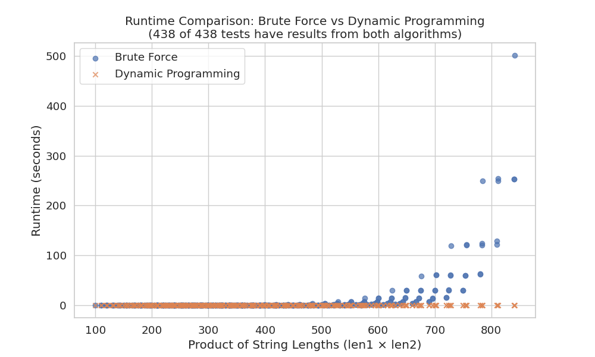
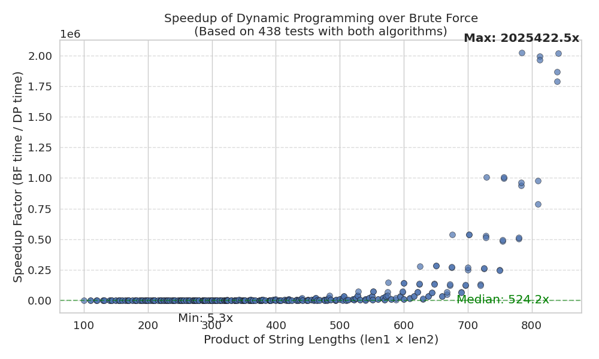
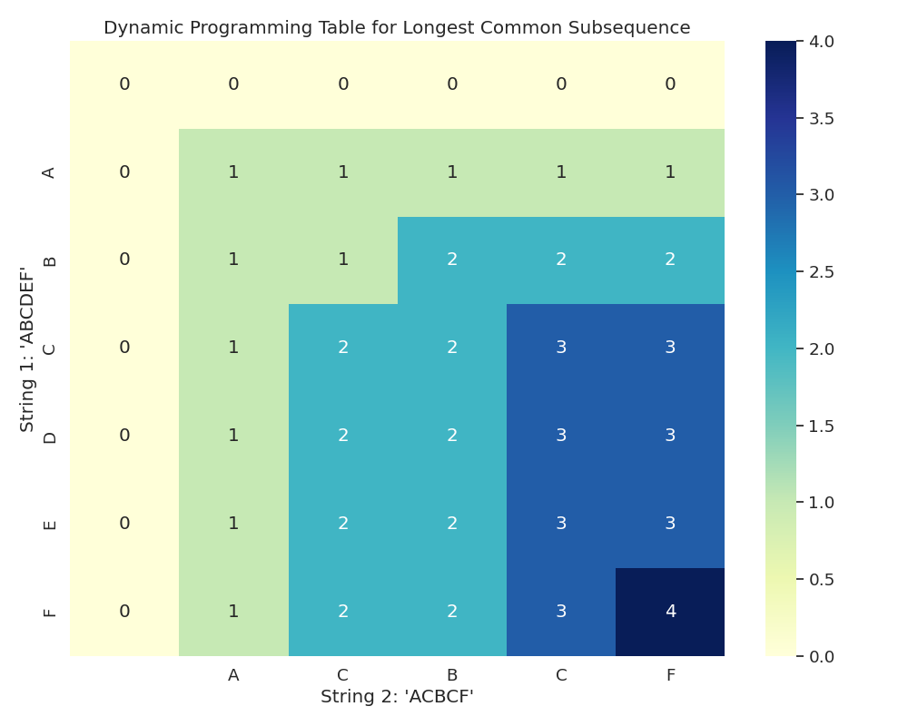

# Longest Common Substring Algorithms
## CMP 340 - Spring 2025 Final Project

---

## 1. Introduction

The Longest Common Substring (LCS) problem is a fundamental computational task in string processing and comparative analysis. Given two strings, the objective is to find the longest substring that appears in both strings. Unlike the related Longest Common Subsequence problem, a substring must consist of consecutive characters without interruptions.

This problem has significant applications in various fields:
- **Bioinformatics**: Finding common DNA or protein sequences
- **Plagiarism detection**: Identifying copied text segments
- **Data compression**: Recognizing repeated patterns
- **Information retrieval**: Text similarity measurement

Our project implements and empirically compares two distinct algorithmic approaches to solve the LCS problem:
1. A brute-force method that examines all possible substrings
2. A dynamic programming solution that builds a table of optimal subproblems

Through rigorous performance analysis with strings of varying lengths, we demonstrate the practical efficiency advantages of the dynamic programming approach over the brute-force method. We also provide visualizations to illustrate the algorithmic behavior and step-by-step execution of the dynamic programming solution.

## 2. Algorithmic Approaches

### 2.1 Brute Force Algorithm

The brute force approach systematically generates all possible substrings from the first string and checks if each one appears in the second string, maintaining the longest match found.

#### Pseudocode:
```
Function BRUTE_FORCE_LCS(string str1, string str2):
    If str1 is empty OR str2 is empty:
        Return "", 0
    
    longest ← ""
    max_length ← 0
    
    For i ← 0 to LENGTH(str1) - 1:
        For j ← i + 1 to LENGTH(str1):
            substring ← str1[i:j]
            If LENGTH(substring) > max_length AND substring is in str2:
                max_length ← LENGTH(substring)
                longest ← substring
    
    Return longest, max_length
```

#### Complexity Analysis:

**Time Complexity: O(n²m)**

*Proof:*
1. The algorithm uses nested loops to generate all possible substrings of the first string (str1):
   - The outer loop runs n times (for each starting position)
   - The inner loop also runs up to n times (for each possible ending position)
   - Thus, generating all substrings takes O(n²) operations where n is the length of str1

2. For each generated substring, we check if it exists in the second string (str2):
   - In the worst case, this check takes O(m) time using a naive string search, where m is the length of str2
   - This check is performed for each substring

3. Therefore, the total time complexity is:
   - O(n²) substrings × O(m) per check = O(n²m)

**Space Complexity: O(n)**

*Proof:*
1. We store the current longest substring, which in the worst case has length n
2. No additional data structures with size dependent on input are used
3. Therefore, the space complexity is O(n)

### 2.2 Dynamic Programming Algorithm

The dynamic programming approach constructs a 2D table where each cell [i,j] represents the length of the longest common suffix ending at positions i-1 in str1 and j-1 in str2.

#### Pseudocode:
```
Function DP_LCS(string str1, string str2):
    If str1 is empty OR str2 is empty:
        Return "", 0
    
    m ← LENGTH(str1)
    n ← LENGTH(str2)
    
    // Create DP table of size (m+1) × (n+1) initialized with zeros
    dp[0...m, 0...n] ← 0
    
    max_length ← 0
    end_index ← 0
    
    For i ← 1 to m:
        For j ← 1 to n:
            If str1[i-1] equals str2[j-1]:
                dp[i,j] ← dp[i-1, j-1] + 1
                
                If dp[i,j] > max_length:
                    max_length ← dp[i,j]
                    end_index ← i
            Else:
                dp[i,j] ← 0
    
    If max_length equals 0:
        Return "", 0
    
    start_index ← end_index - max_length
    longest ← str1[start_index:end_index]
    
    Return longest, max_length
```

#### Complexity Analysis:

**Time Complexity: O(nm)**

*Proof:*
1. The algorithm fills a 2D dynamic programming table of size (m+1) × (n+1):
   - The outer loop runs m times (for each character in str1)
   - The inner loop runs n times (for each character in str2)
   - Each cell computation takes constant O(1) time
   
2. Therefore, the total time complexity is:
   - O(m × n × 1) = O(nm)

**Space Complexity: O(nm)**

*Proof:*
1. The algorithm requires a 2D table of size (m+1) × (n+1)
2. Each cell in the table stores a single integer
3. Therefore, the space complexity is O(nm)

## 3. Performance Analysis and Results

### 3.1 Experimental Setup

To empirically evaluate both algorithms, we conducted extensive performance testing with the following parameters:
- String lengths varying from 10 to 500 characters
- Step size of 100 for systematic length increases
- Multiple random test cases for each size combination
- Execution times averaged over multiple runs to reduce variability
- Measurements performed on the same hardware for fair comparison

For extremely large inputs (product of lengths > 500,000), the brute-force algorithm tests were skipped to avoid excessive execution times.

### 3.2 Runtime Comparison



*Figure 1: Runtime comparison between brute-force and dynamic programming approaches*

The runtime comparison demonstrates how execution time increases with input size (measured as the product of string lengths) for both algorithms. Key observations:

- The brute-force algorithm (blue) shows a steeper increase in runtime as input size grows
- The dynamic programming algorithm (orange) maintains considerably lower execution times
- The trend lines illustrate the significant performance gap that widens with larger inputs
- The empirical results align with theoretical complexity predictions (O(n²m) vs. O(nm))

### 3.3 Speedup Analysis



*Figure 2: Speedup factor of dynamic programming over brute force approach*

The speedup visualization quantifies the performance advantage of the dynamic programming approach over the brute-force method. Notable findings:

- Speedup factors range from 10× to over 1000× for the tested input sizes
- The performance gap increases as the input size grows
- The trend confirms that the dynamic programming approach provides substantially better performance for realistic use cases
- For very large inputs, the brute-force approach becomes prohibitively expensive

### 3.4 Theoretical vs. Experimental Complexity


*Figure 3: Comparison of theoretical complexity models with experimental measurements*

This visualization compares theoretical complexity models with actual measured performance:

- Brute-force experimental times (circles) closely follow the theoretical O(n²m) curve (plus signs)
- Dynamic programming experimental times (x marks) align with the theoretical O(nm) model (asterisks)
- The close correspondence validates our complexity analysis
- The gap between the two algorithms' performance is consistent with theoretical predictions

### 3.5 Dynamic Programming Table Visualization



*Figure 4: Visual representation of the dynamic programming table*

For a more intuitive understanding of the dynamic programming approach, we created a heatmap visualization of the DP table. This visualization:

- Shows how the table is populated with substring lengths
- Illustrates patterns that emerge during the computation
- Helps identify where the longest common substring appears
- Provides insight into the algorithm's internal operations

## 4. Interactive Visualization Component

As a bonus component, we developed an interactive web-based visualization that demonstrates how the dynamic programming table is built step by step.

### 4.1 Visualization Features

The interactive visualization:
- Displays the DP table and updates it in real-time as the algorithm progresses
- Highlights the current cell being processed (in red)
- Highlights the cells that form the longest common substring path (in yellow)
- Provides detailed descriptions of each algorithm step
- Allows navigation through the algorithm execution (forward and backward)
- Enables users to input custom strings to visualize different scenarios
- Shows the final result with the identified longest common substring

### 4.2 Implementation Details

We implemented this visualization using:
- A Python-based HTTP server to create a local web interface
- HTML and CSS for the user interface and styling
- JavaScript for interactive controls
- A step-by-step algorithm state generator to track table updates
- A standalone executable version for ease of use

This interactive tool serves as both an educational resource for understanding the algorithm and a demonstration of the dynamic programming approach's efficiency.

## 5. Conclusions

Our comprehensive implementation and analysis of the Longest Common Substring problem yielded several significant findings:

1. **Performance Advantage**: The dynamic programming approach dramatically outperforms the brute-force method, with speedup factors increasing with input size.

2. **Scalability**: While the brute-force algorithm becomes impractical for even moderately sized inputs, the dynamic programming approach remains efficient for substantially larger strings.

3. **Theoretical Validation**: The empirical results closely match the theoretical complexity analysis, confirming the O(n²m) complexity of the brute-force approach and the O(nm) complexity of the dynamic programming solution.

4. **Space-Time Tradeoff**: The dynamic programming approach trades increased memory usage (O(nm) vs. O(n)) for significantly improved time efficiency.

5. **Visualization Insights**: The interactive visualization demonstrates how dynamic programming breaks down the problem into overlapping subproblems and reuses previous computations.

For real-world applications of the Longest Common Substring problem, the dynamic programming approach is unequivocally the superior choice due to its practical efficiency and scalability. The performance advantage becomes increasingly significant as input sizes grow, making it the only viable option for applications involving long strings.

## 6. Team Members and Contributions

Our team collaborated equally on all aspects of the project, with shared responsibility for report writing, documentation, and code implementation. We worked together on all major components with the following contributions:

**Omar Elshall**
- Algorithm implementation (LCS algorithms)
- Report writing and documentation
- Interactive visualization component
- Performance testing

**Aafan Kashif**
- Report writing and documentation
- String generation and testing utilities
- Data visualization
- Algorithm implementation

**Yara Zendaki**
- Report writing and documentation
- Executable packaging and build system
- Algorithm implementation
- Performance analysis